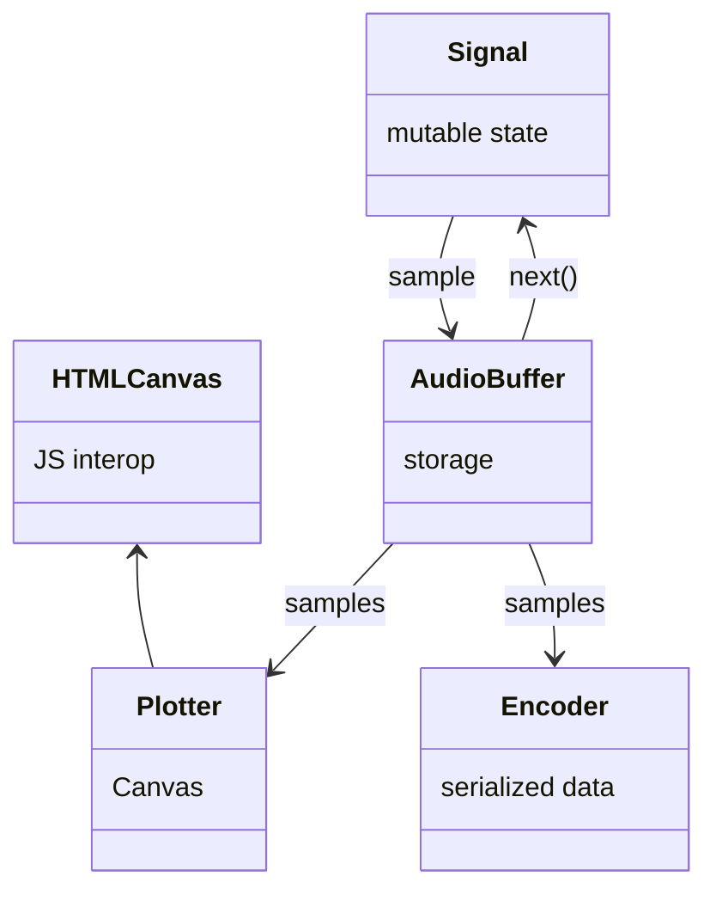

```mermaid
classDiagram
Signal <-- Audio Buffer: next()
Signal --> Audio Buffer: sample
Signal : mutable state
Audio Buffer --> Plotter: samples
Audio Buffer --> Encoder: samples
Audio Buffer : storage
Plotter : Canvas
HTMLCanvas <-- Plotter
HTMLCanvas : JS interop
Encoder : serialized data
```
